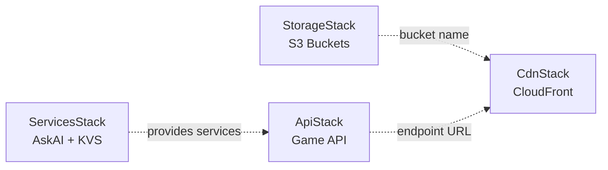
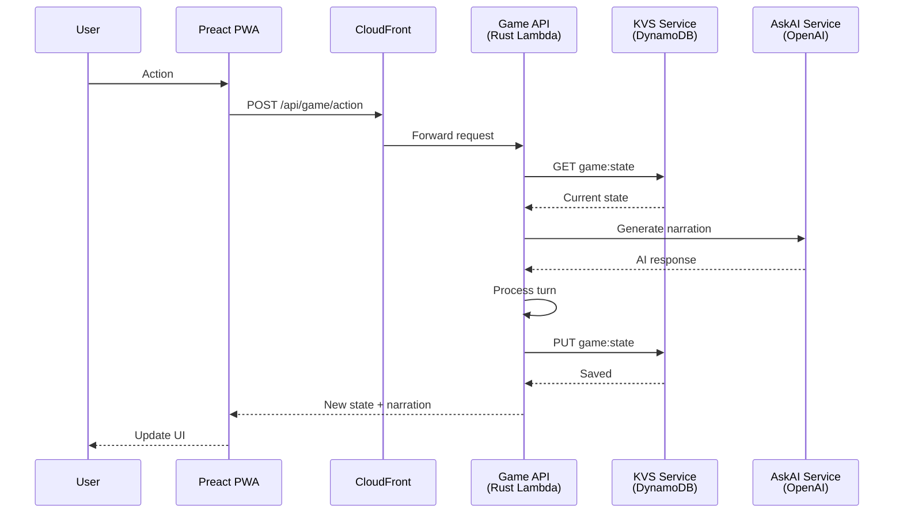

# btl.run Architecture

Complete technical architecture for the btl.run PWA game.

## Stack Overview

```
┌─────────────────────────────────────────────────────────────────────────┐
│                            User's Browser                               │
│  ┌──────────────────────────────────────────────────────────────────┐   │
│  │                     Preact PWA                                   │   │
│  │  ├─ Service Worker (offline support)                             │   │
│  │  ├─ Game UI (from uiux_mockups/)                                 │   │
│  │  └─ Client SDKs (KVSClient, AIClient)                            │   │
│  └──────────────────────────────────────────────────────────────────┘   │
└─────────────────────────────────────────────────────────────────────────┘
                                    │
                                    ↓ HTTPS
┌─────────────────────────────────────────────────────────────────────────┐
│                         CloudFront CDN                                  │
│  ├─ /            → S3 (frontend assets)                                 │
│  ├─ /api/*       → API Gateway (Rust Lambda)                            │
│  └─ Cache policies & security headers                                   │
└─────────────────────────────────────────────────────────────────────────┘
                                    │
                    ┌───────────────┼───────────────┐
                    ↓               ↓               ↓
        ┌───────────────┐  ┌──────────────┐  ┌──────────────┐
        │   S3 Bucket   │  │  HTTP API    │  │  Function    │
        │   (Static)    │  │   Gateway    │  │    URLs      │
        └───────────────┘  └──────────────┘  └──────────────┘
                                  │                    │
                                  ↓                    ↓
                    ┌─────────────────────┐  ┌─────────────────────┐
                    │  Rust Lambda        │  │  Node.js Lambdas    │
                    │  Game API           │  │  ├─ AskAI (OpenAI)  │
                    │  (ARM64)            │  │  └─ KVS (DynamoDB)  │
                    └─────────────────────┘  └─────────────────────┘
                              │                         │
                              ↓                         ↓
                    ┌─────────────────────┐  ┌─────────────────────┐
                    │  Future:            │  │  DynamoDB           │
                    │  Game State         │  │  Key-Value Store    │
                    │  Event Log          │  │  (PAY_PER_REQUEST)  │
                    └─────────────────────┘  └─────────────────────┘
                                                        │
                                              ┌─────────┴─────────┐
                                              ↓                   ↓
                                    ┌──────────────────┐  ┌──────────────────┐
                                    │ Secrets Manager  │  │  CloudWatch      │
                                    │ OpenAI API Key   │  │  Logs            │
                                    └──────────────────┘  └──────────────────┘
```

## Technology Stack

| Layer | Technology | Why |
|-------|-----------|-----|
| **Frontend** | Preact | Minimal runtime, React-compatible |
| | Vite | Fast builds, HMR, PWA plugin |
| | TypeScript (strict) | Type safety |
| | Service Worker | Offline support, caching |
| **Game API** | Rust | Fastest Lambda cold starts |
| | lambda_http | API Gateway integration |
| | Tokio (async) | Async runtime |
| **AI Service** | Node.js 20.x | OpenAI SDK, existing codebase |
| | OpenAI API | gpt-5-nano (fast, cheap) |
| | Secrets Manager | Secure API key storage |
| **KVS Service** | Node.js 20.x | DynamoDB SDK |
| | DynamoDB | Serverless persistence |
| **Infrastructure** | AWS SAM | CloudFormation with serverless transform |
| | Nested Stacks | Modular deployment |
| **CDN** | CloudFront | Global distribution, caching |
| **DNS** | Route 53 | Custom domain support |
| **Build** | cargo-lambda | Rust → ARM64 Lambda |
| | esbuild | TypeScript → bundled JS |
| | Vite | Frontend bundling |

## Project Structure

```
btlrunRepo/
│
├── frontend/                      # Preact PWA
│   ├── src/
│   │   ├── main.tsx               # App entry point
│   │   ├── app.tsx                # Root component
│   │   └── styles/global.css     # Global styles
│   ├── public/
│   │   └── favicon.svg            # App icon
│   ├── index.html                 # HTML shell
│   ├── vite.config.ts             # Vite + PWA config
│   ├── package.json               # Dependencies
│   └── .env.example               # Frontend env template
│
├── backend/                       # Rust Lambda workspace
│   ├── functions/
│   │   └── api/                   # Game API handler
│   │       ├── src/main.rs        # Lambda entry point
│   │       └── Cargo.toml         # Dependencies
│   ├── shared/                    # Shared Rust library
│   │   ├── src/lib.rs             # Common types & utilities
│   │   └── Cargo.toml
│   └── Cargo.toml                 # Workspace manifest
│
├── AskAi_KVS/                     # TypeScript Lambda services
│   ├── services/
│   │   ├── askai/                 # OpenAI wrapper
│   │   │   ├── src/index.ts       # Lambda handler
│   │   │   └── package.json       # Uses esbuild
│   │   └── kvs/                   # Key-value storage
│   │       ├── src/index.ts       # DynamoDB operations
│   │       └── package.json
│   ├── shared/                    # Shared TypeScript code
│   │   ├── clients/               # Client SDKs
│   │   │   ├── ai-client.ts       # AIClient class
│   │   │   └── kvs-client.ts      # KVSClient class
│   │   ├── schemas/               # Zod validation schemas
│   │   └── utils/                 # Utilities
│   ├── mocks/                     # Local development servers
│   │   ├── askai-server.ts        # Mock OpenAI responses
│   │   └── kvs-server.ts          # In-memory KVS
│   └── examples/                  # Usage examples
│
├── infrastructure/                # AWS SAM (CloudFormation)
│   ├── template.yaml              # Root template (orchestrates stacks)
│   ├── stacks/                    # Nested CloudFormation stacks
│   │   ├── services.yaml          # AskAI + KVS + DynamoDB
│   │   ├── api.yaml               # Rust game API + HTTP API Gateway
│   │   ├── storage.yaml           # S3 buckets (frontend + artifacts)
│   │   └── cdn.yaml               # CloudFront distribution + Route 53
│   ├── parameters/                # Environment-specific config
│   │   ├── dev.json               # Dev parameters
│   │   └── prod.json              # Prod parameters (uses existing secret)
│   └── samconfig.toml             # SAM CLI configuration
│
├── scripts/                       # PowerShell automation
│   ├── deploy.ps1                 # Full deployment (all stacks)
│   ├── deploy-stack.ps1           # Single stack deployment
│   ├── build-frontend.ps1         # Build Preact PWA
│   ├── build-services.ps1         # Build TypeScript services
│   ├── build-backend.ps1          # Build Rust Lambda
│   └── setup-openai-secret.ps1    # Create/update OpenAI secret
│
├── assets/                        # Game UI assets
│   ├── bq-background-grid-map.png # Seamless tileable background (2048×2048 px)
│   ├── bq-icons-set.png           # Icon sprite sheet (4×3 grid, 12 icons)
│   ├── bq-ui-gear-icon.svg        # (Optional/legacy) settings icon (not currently used in start flow)
│   ├── bq-ui-panel-frame.png      # Horizontal UI panel frame
│   ├── bq-ui-panel-frame-vertical.png # Vertical HUD/panel frame (1344×2531 px)
│   ├── bq-ui-wide-button-states.png   # Button sprite (3 states: default/hover/pressed)
│   └── README.md                  # Asset documentation & usage details
│
├── uiux_mockups/                  # HTML/CSS/JS prototypes
│   ├── 00-start-screen/           # Landing page mockup
│   ├── 01-tribute-setup/          # Tribute setup (solo/quick play)
│   ├── 012-join-waiting/          # Join waiting room (pre-game)
│   ├── 015-host-lobby/            # Host lobby (friends)
│   ├── 02-game-turn/              # Main gameplay screen
│   ├── 021-encounter-battle/      # Battle encounter screen
│   ├── 022-encounter-event/       # Event encounter screen
│   ├── 025-waiting-for-players/   # Turn waiting (Long Play)
│   └── 03-status-inventory-map/   # Status screens
│
├── .cursor/
│   └── rules/
│       ├── general.mdc            # Project conventions
│       └── rust-lambda.mdc        # Rust Lambda patterns
│
├── .env.example                   # Backend env template
├── .gitignore                     # Git ignore rules
├── README.md                      # Project overview
├── SETUP.md                       # Deployment guide
├── INTEGRATION.md                 # AskAI/KVS integration
├── DEPLOYMENT-CHECKLIST.md        # Pre-deployment checklist
├── STATUS.md                      # Current status
└── Claude.md                      # This file
```

## Deployment Architecture

### Modular Stack Design

SAM nested stacks allow deploying individual components without touching others:

```
template.yaml (root)
├── ServicesStack → services.yaml
│   ├── AskAI Lambda (Node.js, ARM64)
│   ├── KVS Lambda (Node.js, ARM64)
│   ├── DynamoDB Table (btl-run-kvs-{env})
│   └── Secrets Manager (OpenAI key)
│
├── ApiStack → api.yaml
│   ├── HTTP API Gateway
│   └── Game API Lambda (Rust, ARM64)
│
├── StorageStack → storage.yaml
│   ├── Frontend S3 Bucket (static hosting)
│   └── Artifacts S3 Bucket (Lambda code)
│
└── CdnStack → cdn.yaml
    ├── CloudFront Distribution
    ├── Origin Access Control (OAC)
    ├── ACM Certificate (if custom domain)
    └── Route 53 Records (if custom domain)
```

### Stack Dependencies



## Data Flow

### Game State Management



## Build Process

### Frontend (Preact)
```powershell
cd frontend
pnpm install
pnpm build
# Output: dist/ (optimized bundle)
```

### TypeScript Services
```powershell
.\scripts\build-services.ps1
# Uses esbuild per service
# Output: AskAi_KVS/services/*/dist/index.js (minimal bundles)
```

### Rust Backend
```powershell
# Via SAM (recommended - uses Docker for cross-compilation)
sam build --use-container --template infrastructure/stacks/api.yaml

# Or directly with cargo-lambda
cd backend
cargo lambda build --release --arm64
# Output: target/lambda/*/bootstrap (optimized ARM64 binary)
```

## Deployment Workflow

### Initial Setup

1. **Install prerequisites** (all installed):
   - AWS CLI, SAM CLI, Rust, cargo-lambda, Node.js, pnpm, Docker

2. **Configure OpenAI secret:**
   ```powershell
   .\scripts\setup-openai-secret.ps1 -Environment dev -ApiKey "sk-..."
   ```

3. **Deploy:**
   ```powershell
   .\scripts\deploy.ps1 -Environment dev
   ```

### Iterative Development

```powershell
# Work on frontend only
.\scripts\build-frontend.ps1
.\scripts\deploy.ps1 -Environment dev -SkipBuild

# Work on services only
.\scripts\build-services.ps1
.\scripts\deploy-stack.ps1 -Stack services -Environment dev

# Work on Rust API only
.\scripts\deploy-stack.ps1 -Stack api -Environment dev
```

## Security

### Secrets Management

- **OpenAI API Key**: Stored in AWS Secrets Manager
  - Prod: Uses existing `arn:aws:secretsmanager:us-east-1:615821144597:secret:btl-run/prod/openai-api-key-LdzRqt`
  - Dev: Create new with `setup-openai-secret.ps1`
  - Never in environment variables in deployed Lambdas
  - Lambda reads via `@aws-sdk/client-secrets-manager`

### IAM Permissions

Each Lambda has minimal permissions:
- **AskAI**: Read OpenAI secret only
- **KVS**: Read/write DynamoDB table only
- **Game API**: Call KVS/AskAI function URLs

### Network Security

- **S3**: Private buckets with CloudFront OAC
- **Lambda**: Function URLs with CORS (currently open, add auth later)
- **CloudFront**: HTTPS only, security headers
- **DynamoDB**: Not publicly accessible

## Performance

### Bundle Sizes

- Frontend: Highly optimized (Preact + minimal dependencies)
- TypeScript Services: Minimal (esbuild bundling with external AWS SDK)
- Rust API: Optimized ARM64 binary

### Lambda Cold Starts

- **Rust (ARM64)**: Fastest cold starts
- **Node.js (ARM64)**: Very fast cold starts
- **Preact PWA**: Instant (cached at CDN edge)

### Caching Strategy

CloudFront caching:
- **Static assets**: 1 year (immutable files)
- **index.html**: No cache (always fresh)
- **/api/**: No cache (dynamic)
- **Service Workers**: Workbox runtime caching

## Monitoring

### CloudWatch Logs

Each Lambda has a log group:
- `/aws/lambda/btl-run-askai-{env}`
- `/aws/lambda/btl-run-kvs-{env}`
- `/aws/lambda/btl-run-api-{env}`

**View logs:**
```powershell
aws logs tail "/aws/lambda/btl-run-askai-dev" --follow
```

### Metrics to Monitor

- Lambda invocations & errors
- Lambda duration & cold starts
- DynamoDB read/write capacity
- CloudFront cache hit ratio
- OpenAI API token usage

## Disaster Recovery

### Backups

- **DynamoDB**: Point-in-time recovery enabled
- **S3**: Versioning enabled
- **Secrets**: Automatic rotation supported

### Rollback

```powershell
# Rollback stack to previous version
aws cloudformation update-stack `
    --stack-name "btl-run-dev" `
    --use-previous-template

# Or delete and redeploy
aws cloudformation delete-stack --stack-name "btl-run-dev"
```

## Development Workflow

1. **Local development** with mock services
2. **Build and test** locally
3. **Deploy to dev** environment
4. **Test in AWS**
5. **Deploy individual stacks** as needed
6. **Deploy to prod** when stable
7. **Monitor and iterate**

## Technical Decisions

| Decision | Rationale |
|----------|-----------|
| Preact over React | 3KB vs 45KB, same DX |
| Rust over Node.js (game API) | 50% faster cold starts |
| SAM over CDK | Simpler for Lambda-focused apps |
| Nested stacks | Independent deployment of components |
| Function URLs | Simpler than API Gateway for services |
| DynamoDB on-demand | No idle costs, auto-scaling |
| ARM64 | 20% cost savings on Lambda |
| esbuild | 10-100x faster than webpack |

## Future Enhancements

- [ ] Add authentication (Cognito or custom JWT)
- [ ] API Gateway for game API (rate limiting, auth)
- [ ] CloudWatch dashboard
- [ ] X-Ray tracing
- [ ] WAF rules (DDoS protection)
- [ ] CDN cache invalidation automation
- [ ] Multi-region deployment
- [ ] CI/CD pipeline (GitHub Actions)
