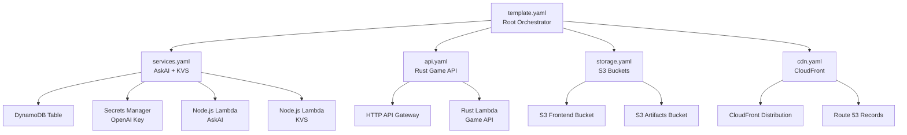

# btl.run — Claude Context

You are implementing a rpg, modern, readable, text-driven battle-royale game.

## Key Constraints
- Static web: S3 + CloudFront (PWA with Preact)
- Serverless API: Rust Lambda + HTTP API Gateway
- Persistence: TypeScript KVS Lambda → DynamoDB
- AI narration/actions: TypeScript AskAI Lambda → OpenAI
- Infrastructure: AWS SAM with nested CloudFormation stacks
- Game modes: Solo (AI or Human Game Master with AI tributes) + Party (mix of human and AI, days exist in customizable minutes) + Long Play (1 real day = 1 game day customizable)
- Prevent infinite games: max days + escalating hazards + sudden death
- Monetization: banner ad placeholder; GM enable hook reserved (free for now)
- Export: PDF recap at end (Lambda preferred)
- Easter egg: extremely rare "died of dysentery"

## Engineering Standards

**ALL CODE MUST BE PRODUCTION-LEVEL QUALITY**

This is not a prototype. Every line of code should be:
- ✅ **Enterprise-grade** - Ready for production deployment
- ✅ **Well-documented** - JSDoc on all exports, comments explain why not what
- ✅ **Fully tested** - Comprehensive test coverage, edge cases handled
- ✅ **Type-safe** - Strict TypeScript, no `any`, explicit return types
- ✅ **Observable** - Rich logging with context (requestId, relevant IDs)
- ✅ **Defensive** - Input validation, error handling, graceful degradation

### Core Patterns
- **TypeScript strict mode** - Frontend and services use strict TypeScript
- **Rust for performance** - Game API uses Rust for optimal Lambda cold starts
- **Zod validation** - All external inputs validated at boundaries (see `AskAi_KVS/shared/schemas/`)
- **Pure functions** - Game engine and simulation logic have no side effects
- **Event sourcing** - Append-only event log + materialized snapshots in KVS
- **Deterministic simulation** - Seeded PRNG for reproducible replays
- **Modular infrastructure** - SAM nested stacks for independent deployment

See `.cursor/rules/general.mdc` for complete project conventions.

## Shell Commands
This project runs on Windows with PowerShell. Always use PowerShell-compatible syntax:
- Use `;` instead of `&&` to chain commands (or run separately)
- No heredocs (`<<EOF`) — use multiple `-m` flags for git commits
- Use `$env:VAR` instead of `export VAR=` for environment variables
- Paths use backslashes but forward slashes work in most contexts

## Git + File Safety (CRITICAL)

### Never delete uncommitted files
- **Never delete untracked or otherwise uncommitted files** to “clean up before commit”.
- If untracked/uncommitted files exist, **ask the user what to do** (commit, ignore, or delete).
- Do not “clean” by deleting items under `.cursor/`, `.vs/`, `apps/docs/`, or other user-authored areas. If something looks like editor metadata, **leave it alone** and ask.

### When the user says “commit everything”
- Stage and commit **only** relevant project files.
- If there are untracked/uncommitted files you believe should not be committed, **do not delete them**. Instead:
  - leave them untracked, and
  - ask the user whether to commit, ignore, or delete them.

## Local Development

### Environment Setup

**Frontend Development:**
Copy `frontend/.env.example` to `frontend/.env.local`:
```powershell
# For local development with mock servers
VITE_API_ENDPOINT=http://localhost:9000     # Rust Lambda (cargo lambda watch)
VITE_ASKAI_ENDPOINT=http://localhost:9001   # AskAI mock
VITE_KVS_ENDPOINT=http://localhost:9002     # KVS mock (PORT=9002)
```

**Backend/Services:**
Root `.env` for Lambda environment variables during local testing.

### Dev Servers

**Frontend (Preact PWA):**
```powershell
cd frontend
pnpm install
pnpm dev  # → http://localhost:5173
```

**Mock Services (for local testing without AWS):**
```powershell
cd AskAi_KVS

# Terminal 1: KVS Mock (in-memory storage)
npx tsx mocks/kvs-server.ts  # → http://localhost:9000

# Terminal 2: AskAI Mock (simulated AI responses)
npx tsx mocks/askai-server.ts  # → http://localhost:9001
```

**Rust Game API (local Lambda):**
```powershell
cd backend
cargo lambda watch  # → http://localhost:9000/lambda-url/api
# Or use SAM: sam local start-api
```

### Browser Debugging
The Cursor Browser tool can:
- Navigate to `http://localhost:5173` when Vite is running
- Take screenshots and inspect page structure
- Read console messages for debugging
- Interact with UI elements (click, type, etc.)

## Key File Locations
| Purpose | Path |
|---------|------|
| Frontend entry | `frontend/src/main.tsx` |
| Frontend app | `frontend/src/app.tsx` |
| Rust game API | `backend/functions/api/src/main.rs` |
| Rust shared lib | `backend/shared/src/lib.rs` |
| AskAI service | `AskAi_KVS/services/askai/src/index.ts` |
| KVS service | `AskAi_KVS/services/kvs/src/index.ts` |
| Shared schemas | `AskAi_KVS/shared/schemas/index.ts` |
| SAM root template | `infrastructure/template.yaml` |
| SAM nested stacks | `infrastructure/stacks/*.yaml` |
| Build scripts | `scripts/*.ps1` |
| Cursor rules | `.cursor/rules/*.mdc` |

## AWS Infrastructure

Infrastructure is managed via **AWS SAM** in the `infrastructure/` folder.

### Project Structure
```
infrastructure/
├── template.yaml              # Root SAM template (orchestrates nested stacks)
├── stacks/
│   ├── services.yaml          # AskAI + KVS (Node.js Lambda + DynamoDB)
│   ├── api.yaml               # Game API (Rust Lambda + HTTP API Gateway)
│   ├── storage.yaml           # S3 buckets (frontend + artifacts)
│   └── cdn.yaml               # CloudFront + Route 53
├── parameters/
│   ├── dev.json               # Dev environment parameters
│   └── prod.json              # Prod environment parameters
└── samconfig.toml             # SAM CLI configuration
```

### Nested Stack Architecture



### Quick Commands (PowerShell)

```powershell
# Validate templates
sam validate --template infrastructure/template.yaml

# Build everything
.\scripts\build-frontend.ps1     # Preact PWA
.\scripts\build-services.ps1     # TypeScript Lambda services
# Rust builds during SAM deployment

# Deploy full stack
.\scripts\deploy.ps1 -Environment dev

# Deploy individual stacks (faster iteration)
.\scripts\deploy-stack.ps1 -Stack services -Environment dev
.\scripts\deploy-stack.ps1 -Stack api -Environment dev
.\scripts\deploy-stack.ps1 -Stack storage -Environment dev
.\scripts\deploy-stack.ps1 -Stack cdn -Environment dev

# View outputs
aws cloudformation describe-stacks `
    --stack-name "btl-run-dev" `
    --query "Stacks[0].Outputs" `
    --output table
```

### AWS Account Info
- **Region:** us-east-1
- **Account ID:** 615821144597
- **Existing Resources:**
  - OpenAI Secret: `arn:aws:secretsmanager:us-east-1:615821144597:secret:btl-run/prod/openai-api-key-LdzRqt`
  - Existing Lambda: `btl-run-prod-askai`
  - Existing Lambda: `btl-run-prod-kvs`
  - Existing DynamoDB: `btl-run-kvs-prod`

### Adding Resources
Edit nested stack templates in `infrastructure/stacks/*.yaml` or add new nested stacks.
Always validate before deploying:
```powershell
sam validate --template infrastructure/template.yaml
```

## Documentation Files

Current documentation in root directory:
- `README.md` - Project overview and quick start
- `SETUP.md` - Detailed deployment instructions
- `INTEGRATION.md` - AskAI/KVS integration strategy
- `DEPLOYMENT-CHECKLIST.md` - Pre-deployment verification
- `STATUS.md` - Current project status
- `Claude.md` - This file (AI agent context)

These files provide comprehensive setup and deployment guidance. Keep them updated as the project evolves.

## Implementation Status
Currently in **Phase 0 — Infrastructure Setup Complete**:
- ✅ Git repository initialized and pushed to GitHub
- ✅ Preact PWA frontend skeleton (optimized bundle)
- ✅ Rust Lambda backend workspace
- ✅ TypeScript AskAI service (OpenAI wrapper)
- ✅ TypeScript KVS service (DynamoDB storage)
- ✅ AWS SAM infrastructure with modular nested stacks
- ✅ PowerShell deployment automation
- ✅ Cursor cloud agent configuration
- ✅ Build processes verified
- ✅ Comprehensive documentation
- ⏳ Game logic implementation (ready to start)
- ⏳ UI/UX integration (mockups available in uiux_mockups/)
- ⏳ First deployment to AWS (prerequisites installed)
